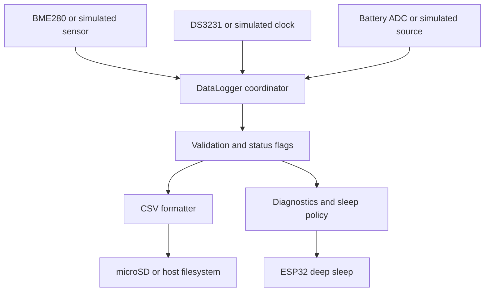

# ESP32 Environmental Data Logger

A local-first, low-power environmental logger for ESP32. It samples a BME280, timestamps readings
with a DS3231, estimates battery state from an ADC divider, appends validated records to daily CSV
files on microSD, and returns to deep sleep. It has no Wi-Fi, account, API key, or cloud dependency.

The same application core runs as a deterministic desktop simulation, so acquisition, validation,
formatting, storage, recovery, and policy logic can be developed and tested without hardware.

## Architecture



Hardware access is isolated behind `IEnvironmentalSensor`, `IClock`, `IBatteryMonitor`, and
`IStorage`. The core owns validation, flags, CSV, daily filenames, battery policy, retries, and
sequence handling. Entry points only wire implementations together and coordinate a cycle.

## Features

- BME280 temperature, humidity, and pressure with NaN/range detection
- DS3231 time with lost-power and plausible-year checks; invalid time never creates a dated file
- Daily `data/YYYY-MM-DD.csv` rotation, automatic header, append writes, and later-cycle retry
- Configurable ADC divider/calibration and linear 3.2–4.2 V battery estimate
- Warning/critical flags; critical state extends sleep from 5 to 30 minutes
- Flags: `SENSOR_ERROR`, `RTC_ERROR`, `SD_ERROR`, `LOW_BATTERY`, `CRITICAL_BATTERY`,
  `INVALID_READING`, and `SIMULATED`
- Timer deep sleep; every ESP32 wake is a fresh boot and retries all peripherals
- Deterministic native simulation and hardware-free Unity tests
- Optional display boundary: shared I2C wiring is documented, but no OLED driver is included, so
  firmware operation does not depend on a display

Unavailable readings are never invented. A record can describe failure with empty environmental
fields. Invalid RTC time skips storage to avoid misleading filenames. SD failures are reported and
retried on a subsequent store/wake; the device continues safely to sleep.

## Hardware and wiring

ESP32, BME280, DS3231, a 3.3 V-compatible SPI microSD module, and a protected single-cell battery
with a safe ADC divider. See [docs/wiring.md](docs/wiring.md) for pins and safety notes.

## CSV schema

```text
timestamp,sequence,temperature_c,humidity_percent,pressure_hpa,battery_voltage,battery_percent,status
2026-10-03T10:00:00,1,22.10,48.00,1012.40,4.05,85,SIMULATED
```

Battery percentage is a voltage estimate, not a fuel-gauge reading. Sequence numbers are per boot.
Synthetic portfolio data is in [docs/example-data.csv](docs/example-data.csv).

## Build and run

Requirements: Python 3 and PlatformIO Core.

```bash
pip install platformio
pio test -e native
pio run -e native
```

```powershell
.pio\build\native\program.exe simulation-output
.\scripts\run-simulation.ps1
```

The script rebuilds the checked-in portfolio artifacts from the actual simulator. Build, flash, and
monitor ESP32 firmware with:

```bash
pio run -e esp32dev
pio run -e esp32dev -t upload
pio device monitor -b 115200
```

Edit [`include/config.h`](include/config.h) for intervals, limits, pins, addresses, ADC calibration,
and battery thresholds.

## Measurement and recovery

Each boot initializes peripherals, samples sensor/battery/time, validates, appends, reports status,
chooses the normal or critical interval, and sleeps. Missing hardware produces flags, not a reboot
loop. Sensor and SD initialization are retried on future wakes. RTC failure prevents file creation
but diagnostics continue over serial.

## Project structure

```text
include/          configuration, interfaces, model, core API
src/core/         portable logic and simulation adapters
src/native/       desktop simulation entry point
src/esp32/        BME280, DS3231, SD, ADC, and sleep adapters
test/test_core/   native Unity tests and failure scenarios
docs/             wiring and generated simulation artifacts
scripts/          artifact-generation command
```

## Verification status

CI runs native tests/build, ESP32 compilation, and clang-format without hardware. When those commands
pass, validation, CSV, battery, filename, sequence, simulation and failure paths are verified in
software, along with native execution and firmware compilation.

Not physically verified: BME280 readings, DS3231 behavior, microSD writes, ADC accuracy, battery
calibration, deep-sleep current, battery life, or OLED hardware. Compilation is not hardware proof.

## Limitations and next steps

The battery curve is deliberately simple; calibration or a fuel-gauge IC would improve it. Sequence
continuity requires retained RTC memory or nonvolatile storage. Next, validate buses and SD recovery
on the target board, measure sleep current, calibrate ADC readings, and implement an optional display
behind its own interface.
